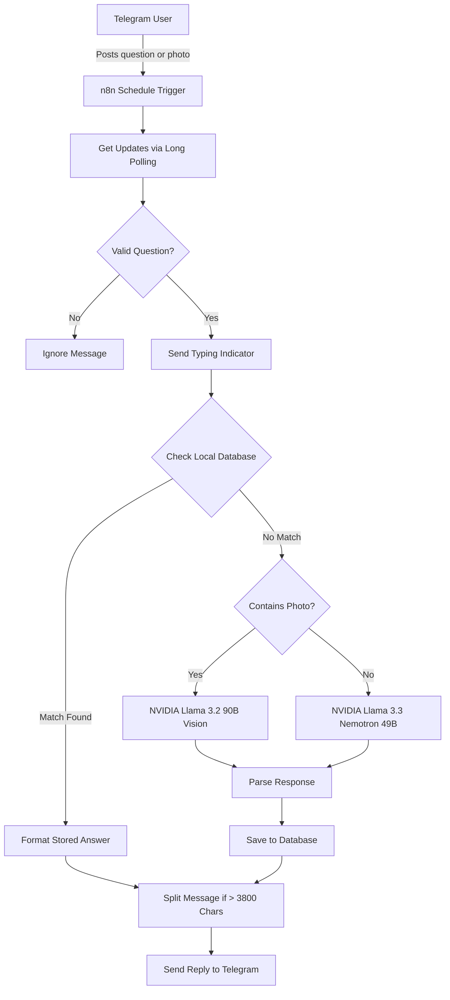

# n8n Telegram Community Q&A Bot

An automated Q&A workflow for Telegram communities built using n8n. It uses a local database table as a first-line cache to answer frequent questions instantly, falling back to NVIDIA LLMs (Nemotron for text, Llama 3.2 for images) only when new questions are asked.

---

## Overview

Managing support in active Telegram groups can be repetitive. This workflow reduces API costs and response times by storing answered questions in an n8n Data Table. 

When a user posts a question or screenshot:
1. The workflow normalizes the message and checks the local database using keyword matching.
2. If a matching question exists, it replies with the stored answer immediately.
3. If no match is found, it sends the query to the NVIDIA NIM API.
4. The new AI answer is sent back to Telegram and saved to the database so future queries can use it without making another API call.

---

## System Architecture



---

## Key Design Considerations

- Local Caching: Questions are evaluated against existing entries using Jaccard keyword similarity (threshold >= 0.62). High-confidence matches bypass LLM API calls entirely.
- Vision Support: Photos and screenshots attached to messages are sent to a vision model (Llama 3.2 90B) to handle visual questions.
- Long Polling Security: The bot uses Telegram's getUpdates method rather than webhooks, so n8n does not need a public IP address or open inbound ports.
- Message Splitting: Replies exceeding Telegram's 4096-character limit are automatically split across multiple numbered messages (e.g. 1/2, 2/2) along paragraph boundaries.

---

## Stack Details

- Automation Platform: n8n
- Workflow File: workflow.json
- Data Store: n8n Data Tables (qa_knowledge_base)
- Text Model: NVIDIA NIM (nvidia/llama-3.3-nemotron-super-49b-v1)
- Vision Model: NVIDIA NIM (meta/llama-3.2-90b-vision-instruct)
- Telegram Handle: @nexushelper421bot

---

## Setup and Installation

1. Import the Workflow:
   - Open n8n.
   - Go to Workflows -> Import from File.
   - Select workflow.json.

2. Create the Database Table:
   - Run the "Create KB Table" node once to set up the qa_knowledge_base table structure.

3. Environment Variables:
   Set the following environment variables when starting n8n:

   ```bash
   N8N_BLOCK_ENV_ACCESS_IN_NODE=false
   TELEGRAM_BOT_TOKEN=<your_bot_token>
   ```

4. Credentials Setup:
   - Configure a Telegram API credential in n8n.
   - Configure a Header Auth credential for NVIDIA NIM (Header Name: Authorization, Value: Bearer nvapi-...).
