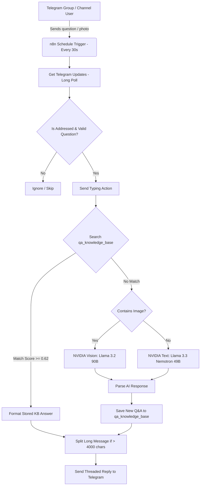

# 🤖 AI Telegram Community Q&A Bot (n8n Workflow)

An automated community support Q&A bot built on **n8n**, powered by an **auto-learning Knowledge Base (KB)** and **NVIDIA NIM LLM & Vision models**.

---

## 📌 Executive Summary

This workflow automatically answers questions posted in Telegram groups/channels. It minimizes AI API costs by maintaining a local Knowledge Base table of past answered questions using fuzzy keyword matching. If a question is not found in the Knowledge Base, it uses NVIDIA NIM AI models (Nemotron for text and Llama 3.2 Vision for images) to generate a full response and saves the result back into the Knowledge Base for zero-cost future reuse.

---

## 🌟 Key Features

* **⚡ 0-Token Cost Instant Answers**: Checks the n8n `qa_knowledge_base` table using keyword similarity ($\ge 0.62$). Instant replies for recurring questions.
* **🧠 Auto-Learning Memory**: Fresh AI answers are automatically ingested into the Knowledge Base for future user queries.
* **📷 Vision / Image Processing**: Accepts photos/screenshots of technical problems or exam questions and diagnoses them using `meta/llama-3.2-90b-vision-instruct`.
* **🔒 Secure Long Polling**: Polls Telegram via `getUpdates` every 30s—no public HTTP endpoints, webhooks, or open ports required.
* **💬 Intelligent Message Handling**: Splits long answers (>3800 characters) into threaded multi-part Telegram messages (`1/2`, `2/2`).

---

## 🏗️ Architecture & Data Flow



---

## 🛠️ Stack & Technical Specifications

| Component | Technology | Description |
| :--- | :--- | :--- |
| **Workflow Engine** | [n8n](https://n8n.io/) | Workflow automation and node routing |
| **Workflow File** | [`workflow.json`](./workflow.json) | Complete n8n workflow definition |
| **Local Knowledge Base** | n8n `dataTable` | `qa_knowledge_base` with Jaccard keyword matching |
| **Text LLM** | NVIDIA NIM `nvidia/llama-3.3-nemotron-super-49b-v1` | Fast, accurate Q&A model |
| **Vision LLM** | NVIDIA NIM `meta/llama-3.2-90b-vision-instruct` | Image & screenshot Q&A model |
| **Target Bot Handle** | `@nexushelper421bot` | Default configured Telegram bot handle |

---

## 🚀 How to Import into n8n

1. Download or clone this repository.
2. In your n8n dashboard, go to **Workflows** → **Import from File**.
3. Select `workflow.json`.

---

## ⚙️ Deployment & Environment Setup

Run n8n with the required environment variables:

```bash
N8N_BLOCK_ENV_ACCESS_IN_NODE=false \
TELEGRAM_BOT_TOKEN="<YOUR_TELEGRAM_BOT_TOKEN>" \
n8n start
```

### Credentials Required in n8n
- **Telegram API Credential**: Bound to Telegram nodes.
- **Header Auth Credential (NVIDIA NIM)**: `Authorization: Bearer nvapi-xxxxxxxxxxxx`.
